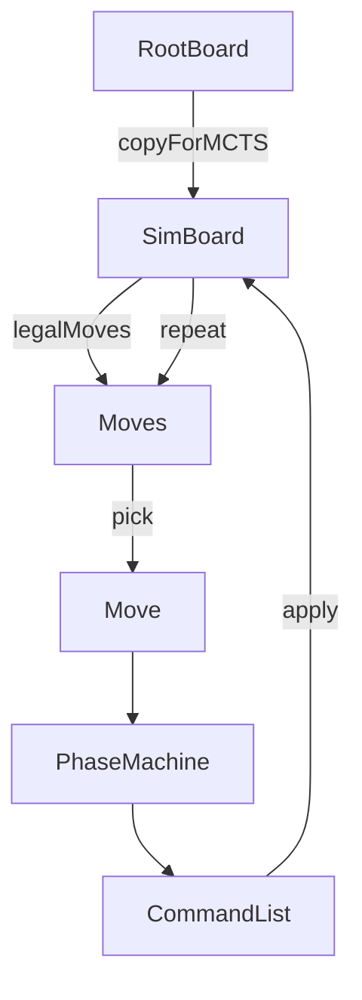

```mermaid
flowchart TB
  Root["RootBoard"] -->|"copyForMCTS"| Sim["SimBoard"]
  Sim -->|"legalMoves"| Moves["Moves"]
  Moves -->|"pick"| Move1["Move"]
  Move1 --> PM2["PhaseMachine"]
  PM2 --> Cmd2["CommandList"]
  Cmd2 -->|"apply"| Sim
  Sim -->|"repeat"| Moves
```