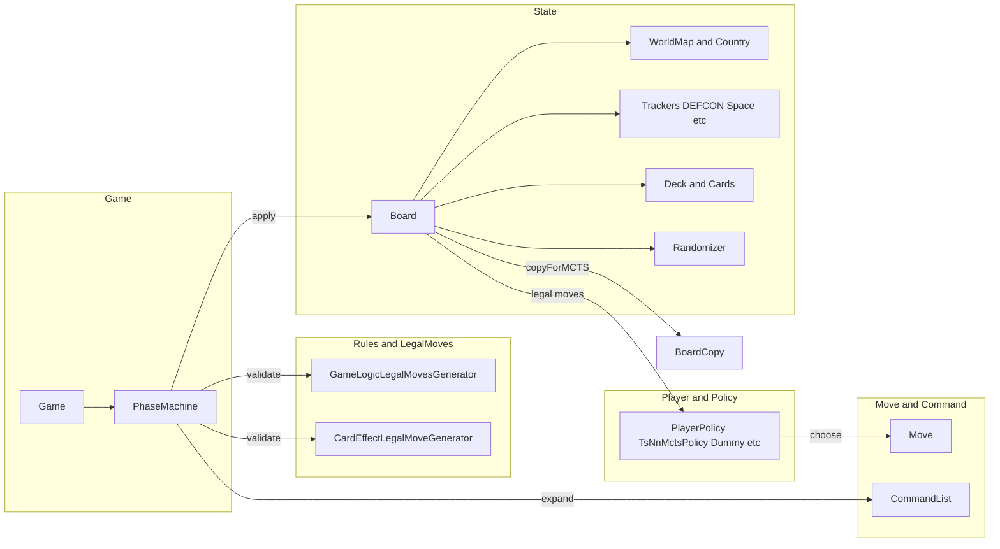

```mermaid
flowchart LR
  subgraph PlayerLayer["Player and Policy"]
    P1["PlayerPolicy TsNnMctsPolicy Dummy etc"]
  end

  subgraph GameLayer["Game"]
    G["Game"]
    PM["PhaseMachine"]
  end

  subgraph RulesLayer["Rules and LegalMoves"]
    GL["GameLogicLegalMovesGenerator"]
    CE["CardEffectLegalMoveGenerator"]
  end

  subgraph CmdMoveLayer["Move and Command"]
    M["Move"]
    C["CommandList"]
  end

  subgraph StateLayer["State"]
    B["Board"]
    WM["WorldMap and Country"]
    TR["Trackers DEFCON Space etc"]
    DK["Deck and Cards"]
    RZ["Randomizer"]
  end

  P1 -->|"choose"| M
  G --> PM
  PM -->|"validate"| GL
  PM -->|"validate"| CE
  PM -->|"expand"| C
  PM -->|"apply"| B

  B -->|"legal moves"| P1

  B --> WM
  B --> TR
  B --> DK
  B --> RZ

  B -->|"copyForMCTS"| B2["BoardCopy"]

```