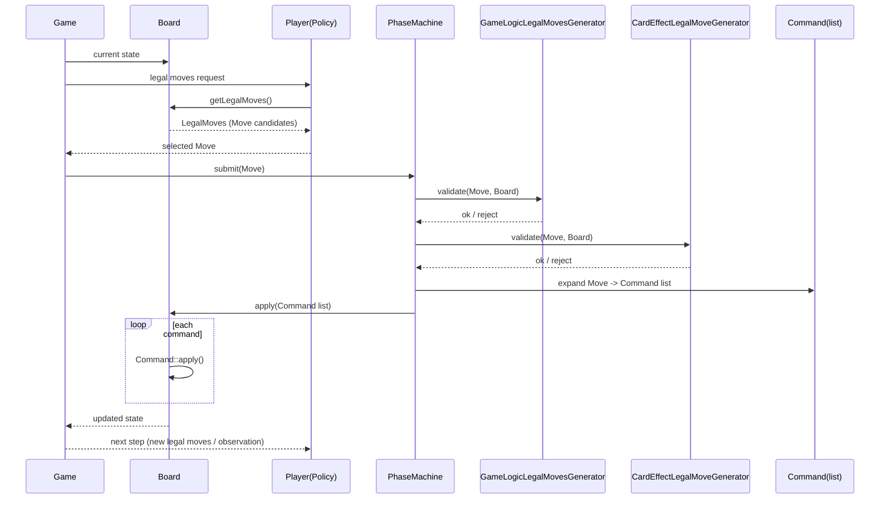

```mermaid
sequenceDiagram
  participant Game as Game
  participant Board as Board
  participant Player as Player(Policy)
  participant PM as PhaseMachine
  participant GL as GameLogicLegalMovesGenerator
  participant CE as CardEffectLegalMoveGenerator
  participant Cmd as Command(list)

  Game->>Board: current state
  Game->>Player: legal moves request
  Player->>Board: getLegalMoves()
  Board-->>Player: LegalMoves (Move candidates)

  Player-->>Game: selected Move
  Game->>PM: submit(Move)

  PM->>GL: validate(Move, Board)
  GL-->>PM: ok / reject
  PM->>CE: validate(Move, Board)
  CE-->>PM: ok / reject

  PM->>Cmd: expand Move -> Command list
  PM->>Board: apply(Command list)
  loop each command
    Board->>Board: Command::apply()
  end

  Board-->>Game: updated state
  Game-->>Player: next step (new legal moves / observation)
```